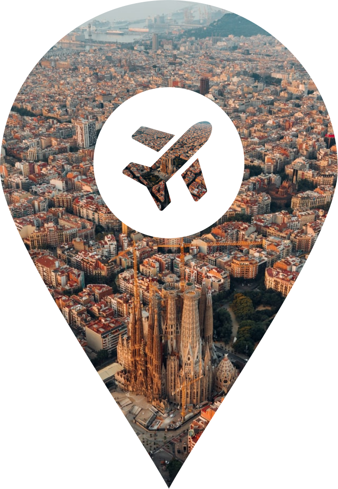

# Wanderlust

  

  A travel planner app for the whole trip.

  
Table of Contents

  <ul>
    <li>
      <a href='#demo-and-screenshots'>
        Demo and Screenshots
      </a>
      <ul>
        <li>
          <a href='#website'>
            Website
          </a>
        </li>
        <li>
          <a href='#mobile'>
            Mobile
          </a>
        </li>
      </ul>
    </li>
    <li>
      <a href='#about-the-project'>
        About the Project
      </a>
      <ul>
        <li>
          <a href='#built-with'>
            Built With
          </a>
        </li>
      </ul>
    </li>
    <li>
      <a href='#getting-started'>
        Getting Started
      </a>
    </li>
    <li>
      <a href='#contributing'>
        Contributing
      </a>
    </li>
    <li>
      <a href='#contact'>
        Contact
      </a>
    </li>
    <li>
      <a href='#acknowledgements'>
        Acknowledgements
      </a>
    </li>
  </ul>

## Demo and Screenshots

<!-- TODO update video link, consider adding portion of live-stream with Q&A, and screenshots -->

Watch the [demo](https://youtu.be/2pH0rkqnBt4).

### Website

### Mobile

## About the Project

A website that plans your entire trip for you and a companion mobile app.

You pick your dates and location; it suggests flights and accommodation to book beforehand and then plans your itinerary during the trip. You can also add your friends so you can all see who booked the same flights/hotels.

**Wanderlust** then gives you the points of interest and restaurants to visit (which you can rearrange to your heart's content). When it's time to travel, the companion app is your best friend. You'll have access to the calendar of the itinerary as well as a map showing all the locations. You'll also be able to see all flights and hotels you've booked. If you select something coming up in the calendar, it will give you directions to it.

### Built With

- [React](https://reactjs.org/)
- [Next.js](https://nextjs.org/)
- [React Native](http://reactnative.dev/)
- [Expo](https://expo.dev/)
- [NodeJS](https://nodejs.org/en/)
- [NestJS](https://nestjs.com/)
- [PostgreSQL](https://www.postgresql.org/)
- [Prisma](https://www.prisma.io/)
- [Heroku](https://www.heroku.com/)

## Getting Started

To get local copies up and running, follow the instructions in the relevant repos:

- [Website](https://github.com/OmarZubaidi/Wanderlust-Website)
- [Mobile App](https://github.com/OmarZubaidi/Wanderlust-Mobile)
- [Server](https://github.com/OmarZubaidi/Wanderlust-Server)

## Contributing

Contributions are welcome!

If you have a suggestion that would make this better:

- Fork the relevant project (e.g. [mobile](https://github.com/OmarZubaidi/Wanderlust-Mobile/fork)).
- Create a branch using `git checkout -b feat-YOUR_FEATURE_NAME`.
- Work on it and commit changes using `npx cz` (you'll get an interactive prompt for the commit message).
- Push to your branch using `git push origin feat-YOUR_FEATURE_NAME`.
- [Open a pull request](https://github.com/OmarZubaidi/Wanderlust-Mobile/compare).

## Contact

Creators: [Daniele Capano](https://github.com/daniele24134/), [Gabriele Zannini](https://github.com/CosmicZanna/), [Omar Zubaidi](https://github.com/OmarZubaidi/), and [Stefan Feldner](https://github.com/stefanfeldner/).

Project Link: [on GitHub](https://github.com/OmarZubaidi/Wanderlust/).

## Acknowledgements

- [Amadeus](https://developers.amadeus.com/)
- [Auth0](https://auth0.com/)
- [Google Maps](https://developers.google.com/maps/)
- [Open Weather Map](https://openweathermap.org/api)
